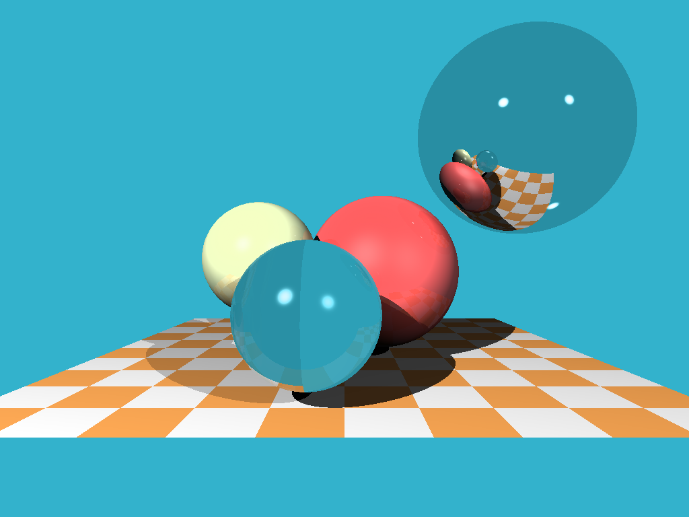

## A Tiny Raytracer in Go

Inspired by https://github.com/ssloy/tinyraytracer

### Next Steps

- env map
- triangles
- fix refraction
- simplify / minify / concurrency
- fix directory structure
- split the struct code and rendering code